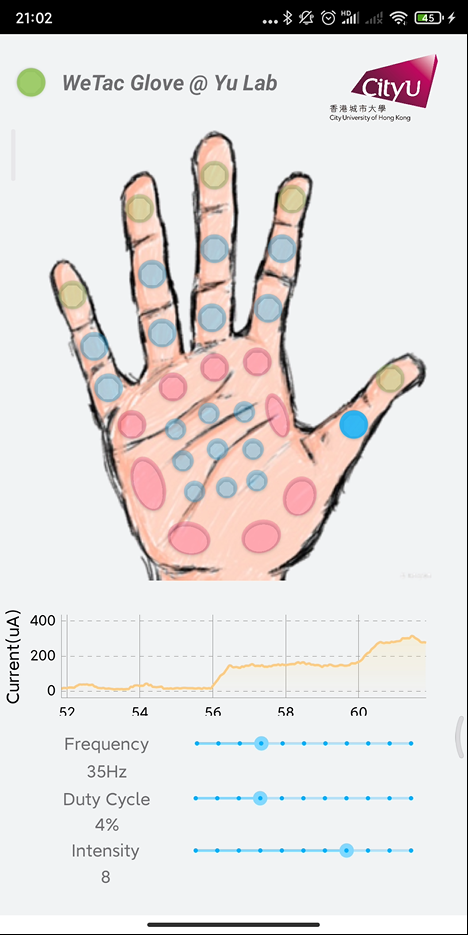

## WeTac control and monitoring code and Matlab data processing code
This is the source code for "Encoding of tactile information in hand via skin-integrated wireless haptic interface" to be published on *Nature Machine Intelligence*.

## 1. Android app code
### 1.1. System requirement
* Android >= 10.0
* Bluetooth >= 4.0

### 1.2. Installation
Go to ./WeTac/app/release, download the compiled APK file to an android phone and open it to install.

### 1.3. Compiler Environment
* Android Studio BumBleBee 2021.1.1 Patch 2

### 1.4. Dependencies
* MPAndroidChart: v3.1.0
* appcompat: 1.3.1
* baseble: 2.0.5
* constraintlayout: 2.1.0
* espresso-core: 3.4.0
* junit: 1.1.3
* material: 1.4.0

### 1.5. Test
This app has tested on
* Redmi Note 9T, MIUI Global 12.5.6(Android 11)
* Xiaomi Mix 2s, MIUI 12.5.1(Android 10)

### 1.6. Instructions for running
* After the app installed on an Android device, open up the bluetooth service of the device, and power on WeTac system. Then open the main interface and wait until the indicator at top left turns green, which means the Bluetooth connection is successful.
* Adjust the suitable parameter for feedback firstly, by dragging the seekbar of "Frequency", "Duty Cycle" and "Intensity", respectively.
* Then select whichever spot on the hand shown in the center by clicking the button. It will turn into a darker color indicating that this channel is "ON" state, meanwhile the actual corresponding channel is firing pulsed currents according to pre-defined parameters.
* Click the same button for another time and as it return to lighter color, this channel is turned "OFF". No current will pass through the hand.
* Parameters could be modified no matter a channel is ON or OFF, and change will apply immediately.
* The chart view shows the real-time monitored current intensity flowing through body, and will start right after device connected. The intensity curve is smoothed by apropriate time-averaging.


## 2. Matlab codes

### 2.1. System requirement
* Windows 7,8,10 or 11
  

### 2.2. Compiler Environment
* Matlab 2017 or newer versions

### 2.3. Dependencies
* These codes are simple and don't need any toolboxes.
* An xlsx file storing threshold current data of each channel
* An xlsx file storing the point cloud coordinates (in 2D)
* An xlsx file storing the row index of stimulation points in point cloud file

### 2.4. Test
* This program has tested on Windows 10 and 11

### 2.5. Instructions for running
* Type in the file name of your data file, and the range of chart, e.g.
```Matlab
[Vx, name] = xlsread('demo.xlsx',1,'B1:B33');%read everyone's threshold data and their names
```
* Type in the file name of row index (e.g.stimulationpoints32.xlsx)
```Matlab
Pts = xlsread('stimulationpoints32.xlsx');%read line number of stimulation points
```
* Type in the file name of point cloud(e.g.handoutline.xlsx)
```Matlab
Hnd = xlsread('handoutline.xlsx');%read point cloud coordinates
```
* Modify colormap, tick labels, scatter size or storage file name as you like
* Then hit start.

### 2.6. Demo
* We have included the above-mentioned 3 .xlsx files. The data are of "Appropriate" level of one subject at *f*s of 25Hz. The heat maps will be shown and stored.
* You can use any other data set that has the same format.
  
## 3. Hardware
### 3.1 Usage
This circuit is designed by easyEDA, the easyEDA project files and Gerber files are provided.

## 4. Firmware
### 4.1. System requirement
* Windows 7,8,10 or 11
* Customized board
* XDS100V3 Debugger

### 4.2. Compiler Environment
* TI Code Composer Studio (CCS): 12.0.0
* SDK: 1_40_00_45
* XDCTOOLS: 3_62_01_16_core
* TI ARM Compiler: V20.2.3 LTS

### 4.3. Usage
This firmware is used for TI CC2640R2FRSMR, build it with CCS and flash it into the MCU through the XDS100V3 debugger. After successfully flashing the program, the circuit can be powered by a 4.2V Li-ion battery. In order for the hardware to work properly, it needs to be paired with the previously mentioned Android App.

## Cite
If you find this useful, cite this paper below
```
Yao, K., Zhou, J., Huang, Q. et al. Encoding of tactile information in hand via skin-integrated wireless haptic interface. Nat Mach Intell (2022). https://doi.org/10.1038/s42256-022-00543-y
```
Thank you !!
